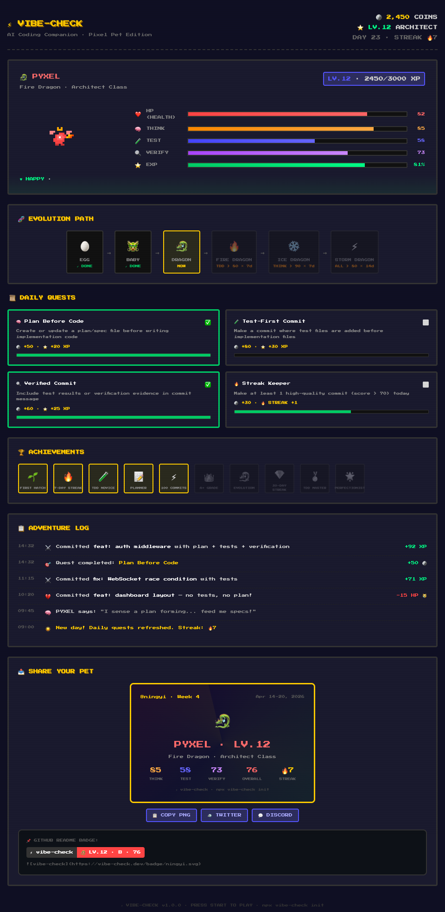

# ⚡ vibe-check

> Your code habits raise a pixel pet. Good engineering = happy dragon. Vibe coding = sick octopus.

<p align="center">
  
</p>

**vibe-check** is a CLI tool that analyzes your Git history, scores the engineering quality of your AI-assisted coding, and visualizes results as a **pixel pet养成游戏** — a tamagotchi-style companion whose health, mood, and evolution are driven by your real coding habits.

## 🎮 Features

- 🐉 **5 Pet Species** — Dragon, Cat, Owl, Octopus, Wolf — assigned by your coding personality
- 📊 **3 Quality Dimensions** — Thoughtfulness, Test Discipline, Verification
- 🧬 **Evolution System** — 4 stages with branching ultimate forms (Fire Dragon, Ice Dragon, Storm Dragon...)
- 📜 **Daily Quests** — Plan Before Code, Test-First Commit, Verified Commit, Streak Keeper
- 🏆 **10 Achievements** — First Hatch, Week Warrior, TDD Master, Perfectionist...
- 📋 **Adventure Log** — Your commits rendered as RPG battle entries
- 📤 **Share** — Pixel cards + GitHub README badges
- ⚡ **Real-time Dashboard** — Pixel art UI, live WebSocket updates

## 🚀 Quick Start

```bash
# In any Git repo
npx vibe-check init          # 🥚 Your egg hatches!
# ... code normally ...
npx vibe-check dashboard     # 🎮 Open pixel dashboard
```

## 📦 Commands

| Command | Description |
|---|---|
| `vibe-check init` | Initialize in current repo, hatch your pet |
| `vibe-check dashboard` | Open real-time pixel dashboard |
| `vibe-check report` | Terminal ASCII report |
| `vibe-check score` | Output single score (0-100) |
| `vibe-check pet` | Show pet status |
| `vibe-check history` | Score trend chart |
| `vibe-check badge` | Generate README SVG badge |
| `vibe-check share` | Generate shareable pixel card (coming soon) |
| `vibe-check uninstall` | Remove from repo |

## 🧠 How Scoring Works

Every commit is scored on 3 dimensions:

| Dimension | What it measures | Weight |
|---|---|---|
| 🧠 **Thoughtfulness** | Plans/specs before code, meaningful commit messages | 35% |
| 🧪 **Test Discipline** | Test-to-implementation ratio, TDD patterns | 35% |
| 🔍 **Verification** | Evidence of testing in commit messages, small focused commits | 30% |

**Grading Scale:**

| Score | Grade | Pet Effect |
|---|---|---|
| 90-100 | A+ Engineering Excellence | +20 XP, +5 HP |
| 80-89 | A Disciplined Collaborator | +15 XP, +3 HP |
| 65-79 | B Conscious Coder | +10 XP |
| 50-64 | C Convenience-Driven | +5 XP, -5 HP |
| < 50 | D Vibe Coder | +2 XP, -15 HP |

## 🐉 Pet Species

Your species is determined by analyzing your last 30 commits:

| Species | Coding Style |
|---|---|
| 🐉 Dragon | High planning, moderate commits (Architect) |
| 🦉 Owl | High TDD ratio (Scientist) |
| 🐱 Cat | Small fast commits, low tests (Speedrunner) |
| 🐺 Wolf | High fix/debug ratio (Fixer) |
| 🐙 Octopus | Default / Vibe Coder |

## 🧬 Evolution

```
🥚 Egg → 🐲 Baby (LV.3) → 🐉 Adult (LV.8) → ⚡ Ultimate (LV.15+)
```

Ultimate forms branch based on your strengths:

| Condition | Dragon | Cat | Owl | Octopus | Wolf |
|---|---|---|---|---|---|
| Test > 80 × 7d | 🔥 Fire | 🦁 Lion | — | — | — |
| Think > 90 × 7d | ❄️ Ice | — | — | — | — |
| All > 80 × 14d | ⚡ Storm | — | — | — | — |
| Streak > 14d | — | 🐆 Shadow | — | — | — |
| A+ × 5d | — | — | 🦅 Phoenix | — | — |
| Verify > 90 × 7d | — | — | 🌙 Moon | — | 🌑 Night |
| Overall > 80 × 7d | — | — | — | 🌊 Tide | — |
| Streak > 30d | — | — | — | — | 🐺 Alpha |

## 🔧 How It Works

1. `vibe-check init` installs a lightweight `post-commit` git hook
2. The hook runs `vibe-check _ingest` asynchronously (non-blocking, <100ms)
3. Each commit is analyzed: file types, diff size, commit message, AI tool detection
4. Scores update your pet's HP, XP, level, mood, and quest progress
5. Dashboard shows everything in real-time via WebSocket

**Privacy:** All data stays local in `.vibe-check/db.sqlite`. No telemetry, no network calls.

## 🛠 Tech Stack

- TypeScript + Node.js 18+
- Commander.js (CLI)
- simple-git (Git operations)
- better-sqlite3 (local storage)
- Express + ws (dashboard server)
- Vite + React + Recharts (dashboard UI)
- Press Start 2P font (pixel aesthetic)

## 📄 License

MIT

---

*Built with ⚡ [superpowers](https://github.com/obra/superpowers) engineering methodology — brainstorming → writing-plans → TDD → subagent-driven-development → verification-before-completion*
